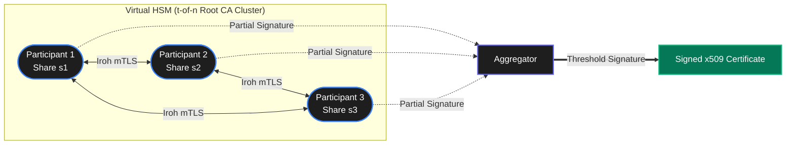
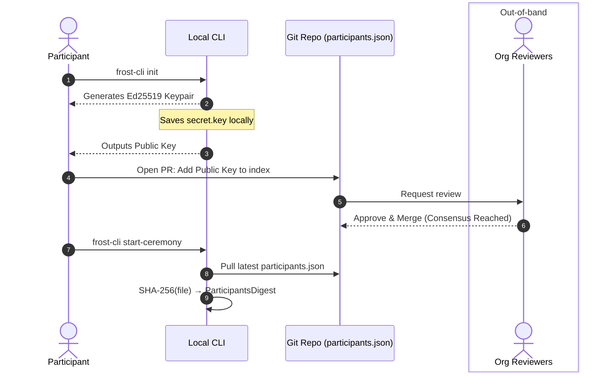
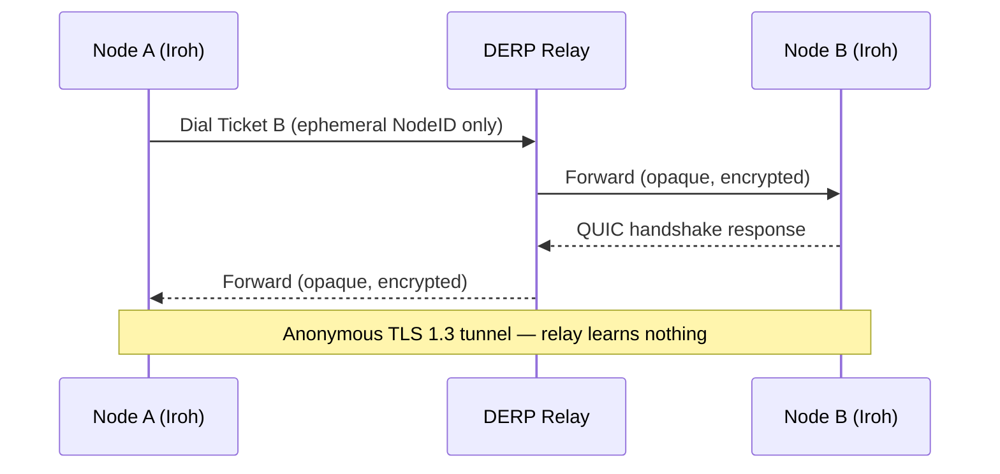
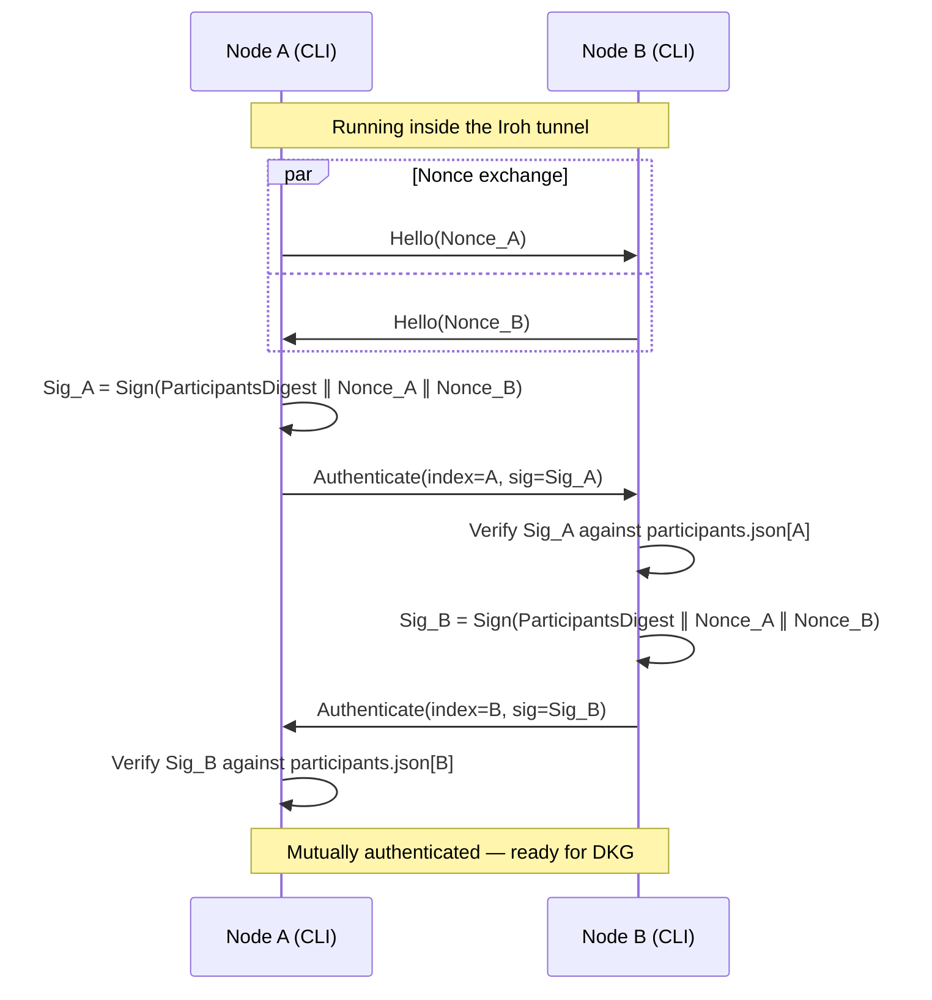

# RFC-0001: Distributed Root CA Bootstrapping via FROST & DKG

## 1. Overview and Motivation

Traditional Root Certificate Authorities (CAs) rely on a single, highly
protected private key, typically stored in a Hardware Security Module
(HSM). This creates a single point of failure and requires complex,
synchronous physical "ceremonies" to operate.

This solution replaces the physical HSM with a **Virtual HSM** powered by
Threshold Cryptography. By utilizing **DKG (Distributed Key Generation)**
and **FROST (Flexible Round-Optimized Schnorr Threshold signatures)**, a
threshold of $t$ out of $n$ participants can securely generate and operate
a Root CA. The complete private key never exists in a single location, and
the networking is handled via an encrypted, peer-to-peer mesh using Iroh.



## 2. Core Architecture Components

* **Git Repository (The Consensus Layer):** Acts as the out-of-band truth
  for participant identities, long-term public keys, and protocol
  parameters (like the threshold $t$).
* **Iroh Networking (The Transport Layer):** Provides NAT traversal, relay
  routing (DERP), and a QUIC-backed, TLS 1.3 encrypted tunnel between
  participants using ephemeral keys.
* **Custom CLI (The Coordinator):** The local binary executed by each
  participant. It manages local secret storage, Iroh connections, the
  inner authentication handshake, and the FROST state machine.

## 3. Protocol Phases

### Phase 1: Configuration & Consensus (GitOps)

Before any network connections are made, the cryptographic parameters must
be agreed upon.

1.  Participants generate long-term Ed25519 identity keypairs locally.
2.  They commit their public keys and chosen index to a
    `participants.json` file in a version-controlled repository.
3.  The CLI reads this file and computes its SHA-256 hash, producing the
    `ParticipantsDigest`. This value is not a session identifier — the
    temporal session is defined by the per-run nonces. Its sole purpose
    is split-brain detection: if any participant has a different version
    of `participants.json`, their digest will not match and the ceremony
    fails before any cryptographic material is exchanged.

#### `participants.json` Schema

```json
{
  "threshold": 2,
  "participants": [
    {
      "index": 1,
      "public_key": "<base64url-encoded Ed25519 public key>"
    }
  ]
}
```

Fields:

* `threshold`: the minimum number of participants ($t$) required to
  produce a valid threshold signature. Must be $\leq n$.
* `participants[].index`: a unique, stable integer identifier for each
  participant. Indices must not be reused across ceremonies.
* `participants[].public_key`: the participant's long-term Ed25519
  public key, base64url-encoded without padding. This is the key used
  to verify `Authenticate` signatures during Phase 3.



### Phase 2: Network Bootstrapping (Outer Tunnel)

To prevent metadata leakage and traffic analysis by relay servers, the
transport layer must be completely decoupled from the long-term
identities.

1.  Upon initialization, the CLI generates a fresh, **ephemeral** Iroh
    keypair.
2.  The CLI connects to the Iroh network and outputs a temporary
    connection ticket.
3.  Participants exchange these tickets out-of-band (e.g., via a secure
    chat channel).
4.  Nodes dial each other using these ephemeral tickets, establishing a
    mutually encrypted TLS 1.3 tunnel over QUIC. Relay servers only see
    random, temporary NodeIDs communicating.

```mermaid
sequenceDiagram
    participant A as Node A
    participant R as DERP Relay
    participant B as Node B

    par
        A->>A: Generate ephemeral Iroh keypair
        A->>R: Connect → receive Ticket A
    and
        B->>B: Generate ephemeral Iroh keypair
        B->>R: Connect → receive Ticket B
    end

    Note over A,B: Exchange tickets out-of-band (e.g. secure chat)
    A-->>B: Share Ticket A
    B-->>A: Share Ticket B

    A->>R: Dial using Ticket B
    R->>B: Route (sees only ephemeral NodeIDs)
    B->>R: Dial using Ticket A
    R->>A: Route (sees only ephemeral NodeIDs)

    Note over A,R,B: QUIC / TLS 1.3 tunnel established
```

### Phase 3: Mutual Authentication (Inner Protocol)

Once the ephemeral P2P tunnel is established, the CLI initiates the
application-layer handshake to prove cryptographic identity without
exposing it to the outside network. The handshake runs in two clearly
separated layers.

**Outer tunnel** — transport only; the relay sees ephemeral NodeIDs and
encrypted QUIC packets, nothing else:



**Inner handshake** — application-layer identity proof over the
established tunnel:



#### Protobuf Schemas

The inner handshake utilizes the following lightweight Protobuf
definitions:

```protobuf
syntax = "proto3";
package frostca.auth.v1;

// Step 1: Sent immediately by both peers upon Iroh stream creation
message Hello {
  // 32-byte cryptographically secure random nonce generated for this
  // specific session
  bytes nonce = 1;
}

// Step 2: Sent after receiving the peer's Hello message
message Authenticate {
  // The participant's index as defined in the Git-tracked
  // participants.json
  uint32 participant_index = 1;

  // Ed25519 signature of the session parameters
  // Signature = Sign(ParticipantsDigest || Sender_Nonce || Receiver_Nonce)
  bytes signature = 2;
}
```

#### Handshake Execution

1.  **Nonce Exchange:** Alice and Bob exchange `Hello` messages containing
    $Nonce_A$ and $Nonce_B$.
2.  **Signature Generation:** Alice calculates
    $Signature_{Alice} = Sign_{sk_{Alice}}(ParticipantsDigest \parallel
    Nonce_A \parallel Nonce_B)$ using her static Git-tracked secret key.
3.  **Authentication:** Alice sends her `Authenticate` message. Bob
    verifies the signature using Alice's public key from
    `participants.json`, the currently known `ParticipantsDigest`, and
    the exchanged nonces. Bob performs the reciprocal process.
4.  **Result:** If verification fails, the connection is instantly
    dropped. If successful, the peers are authenticated and move to the
    DKG phase.

### Phase 4: Distributed Key Generation (DKG)

With a fully authenticated, anti-replay, and metadata-protected P2P mesh
established, the nodes execute the FROST DKG protocol. This is a
two-round protocol in which the complete private key is never assembled
in any single location.

#### Round 1: Commitment Broadcast

Each participant $i$:

1.  Generates a random polynomial $f_i(x)$ of degree $t-1$ over the
    scalar field, where $f_i(0)$ is their secret contribution.
2.  Computes and broadcasts a **Pedersen commitment** to each coefficient
    of the polynomial. These commitments are binding and allow other
    participants to verify the shares they receive.
3.  Computes a secret share $f_i(j)$ for each other participant $j$ and
    sends it privately over the authenticated P2P channel.

#### Round 2: Verification & Share Aggregation

Each participant $j$:

1.  Verifies each received share $f_i(j)$ against participant $i$'s
    published commitments. Any invalid share causes the ceremony to
    abort and identifies the misbehaving participant.
2.  Computes their final **FROST secret share** as the sum of all valid
    incoming shares: $s_j = \sum_i f_i(j)$.
3.  Derives the **Group Public Key** from the sum of all participants'
    constant-term commitments. All nodes must arrive at the same value —
    this is verified before the ceremony is considered complete.

```mermaid
sequenceDiagram
    participant P1 as Participant 1
    participant P2 as Participant 2
    participant P3 as Participant 3

    rect rgb(30, 41, 59)
    Note over P1,P3: Round 1 — Polynomial Commitment & Secret Share Distribution

    par Generate polynomials
        P1->>P1: f1(x) of degree t-1, compute commitments C1
    and
        P2->>P2: f2(x) of degree t-1, compute commitments C2
    and
        P3->>P3: f3(x) of degree t-1, compute commitments C3
    end

    P1->>P2: C1, secret share f1(2)
    P1->>P3: C1, secret share f1(3)
    P2->>P1: C2, secret share f2(1)
    P2->>P3: C2, secret share f2(3)
    P3->>P1: C3, secret share f3(1)
    P3->>P2: C3, secret share f3(2)
    end

    rect rgb(15, 23, 42)
    Note over P1,P3: Round 2 — Verification & Aggregation

    par Verify and aggregate
        P1->>P1: Verify f2(1) vs C2, f3(1) vs C3 — s1 = f1(1)+f2(1)+f3(1)
    and
        P2->>P2: Verify f1(2) vs C1, f3(2) vs C3 — s2 = f1(2)+f2(2)+f3(2)
    and
        P3->>P3: Verify f1(3) vs C1, f2(3) vs C2 — s3 = f1(3)+f2(3)+f3(3)
    end

    Note over P1,P3: All derive the same Group Public Key from C1+C2+C3
    end
```



#### Outputs

* Each participant persists their FROST secret share $s_j$ to local
  encrypted storage. The share must never leave the participant's
  machine.
* The **Group Public Key** is the public key of the new Root CA. It is
  safe to publish and should be distributed as the trust anchor.

### Phase 5: Certificate Signing

Once the Root CA is bootstrapped, the same participant mesh is used to
sign certificates via FROST threshold signing. This requires $t$
participants but does not involve a new DKG — participants already hold
their shares from Phase 4.

#### Round 1: Commitment

Each participating signer $i$:

1.  Generates a fresh random nonce pair $(d_i, e_i)$ and broadcasts the
    corresponding commitments $(D_i, E_i)$ to all other signers.

#### Round 2: Partial Signature

Once all commitments are collected:

1.  A **binding factor** $\rho_i$ is derived for each signer from the
    full set of commitments and the message being signed (the
    certificate's TBS — To-Be-Signed — bytes).
2.  Each signer computes a **partial signature** $z_i$ using their FROST
    secret share $s_i$ and their nonce, then broadcasts it.

#### Aggregation

Any participant (or automated coordinator) aggregates the $t$ partial
signatures into a single **threshold signature**. This signature is
verifiable against the Group Public Key using standard Ed25519
verification — it is indistinguishable from a signature produced by a
conventional single-key CA. The signed certificate is then written to
disk or published directly.

```mermaid
sequenceDiagram
    participant REQ as Certificate Request
    participant P1 as Signer 1
    participant P2 as Signer 2
    participant AGG as Aggregator

    REQ->>P1: TBS (To-Be-Signed bytes)
    REQ->>P2: TBS (To-Be-Signed bytes)

    rect rgb(30, 41, 59)
    Note over P1,AGG: Round 1 — Nonce Commitments

    par
        P1->>P1: Generate nonce pair (d1, e1)
        P1->>AGG: Commitment (D1, E1)
    and
        P2->>P2: Generate nonce pair (d2, e2)
        P2->>AGG: Commitment (D2, E2)
    end

    AGG->>P1: Full commitment set {D1,E1,D2,E2}
    AGG->>P2: Full commitment set {D1,E1,D2,E2}
    end

    rect rgb(15, 23, 42)
    Note over P1,AGG: Round 2 — Partial Signatures

    par
        P1->>P1: Derive binding factor p1, compute z1 using s1
        P1->>AGG: Partial signature z1
    and
        P2->>P2: Derive binding factor p2, compute z2 using s2
        P2->>AGG: Partial signature z2
    end
    end

    AGG->>AGG: Aggregate z1 + z2 → threshold signature σ
    Note over AGG: σ verifiable against Group Public Key\nvia standard Ed25519
    AGG->>REQ: Signed x509 Certificate
```



## 4. Security Considerations

* **Metadata Leakage (Traffic Analysis):** Mitigated via the
  "Inner/Outer Key" pattern. Ephemeral Iroh nodes prevent adversaries
  from monitoring DERP relays to detect ceremony activity.
* **Out-of-Band Ticket Interception:** An adversary who intercepts or
  substitutes ephemeral Iroh tickets during the out-of-band exchange
  can prevent two participants from connecting (Denial of Service) but
  cannot compromise the ceremony. Phase 3 mutual authentication ensures
  that any connection established via a tampered ticket will fail
  signature verification — no cryptographic material is exchanged until
  both participants have proven their identity against `participants.json`.
* **Replay Attacks:** Mitigated via the $Nonce_A$ and $Nonce_B$
  exchange. A captured `Authenticate` payload is useless for future
  sessions because the nonces will change.
* **Split-Brain / State Desync:** Mitigated via the `ParticipantsDigest`.
  Because the hash of `participants.json` is included in the
  authentication signature, any participant operating from a different
  version of the file — whether due to a stale pull or tampering — will
  produce a mismatched digest and be rejected before any cryptographic
  material is exchanged.
* **Git Repository Compromise:** If an attacker modifies
  `participants.json` in Git, they still cannot extract the Root CA
  private key. They could only cause a Denial of Service (by causing
  `ParticipantsDigest` mismatches) or, at worst, participate in a *new*
  DKG ceremony. They cannot access the pre-existing FROST shares stored
  securely on the participants' local machines.

## 5. Liveness & Recovery

#### Share Loss

If a participant loses their FROST secret share (e.g., disk failure),
it cannot be recovered — no other participant holds it, and there is no
reconstruction mechanism that does not require assembling $t$ shares in
a single location, which this design deliberately avoids.

Participants **must** maintain an offline encrypted backup of their
share at the time of the DKG ceremony. A recommended approach is to
encrypt the share to the participant's long-term Ed25519 key and store
it on offline media.

If fewer than $t$ shares survive across all participants, the Root CA
private key is permanently lost. A new DKG ceremony must be run to
produce a new Root CA, and all previously issued certificates will need
to be reissued under the new CA.

#### Participant Rotation

Adding or removing a participant, or changing the threshold $t$, does
**not** require producing a new Root CA. This is achieved via a
**re-sharing protocol** in which the existing $t$ participants
redistribute the current secret to the new participant set, preserving
the Group Public Key throughout.

The key insight is that each old participant $i$ generates a new
polynomial $g_i(x)$ of degree $t'-1$ (the new threshold) with the
constant term fixed to their current share: $g_i(0) = s_i$. New
participants compute their share as $s'_j = \sum_i g_i(j)$. Because
$\sum_i g_i(0) = \sum_i s_i$ equals the original underlying secret,
the Group Public Key is unchanged.

The procedure is:

1.  Update `participants.json` via the GitOps flow (Phase 1). Both the
    old and new participant sets must agree on this version before
    proceeding.
2.  At least $t$ of the old participants run the re-sharing protocol,
    distributing new shares to each incoming participant over
    authenticated P2P channels (Phases 2–3).
3.  Each new participant verifies their received shares against the
    published commitments, aggregates them into their final share, and
    confirms the Group Public Key is unchanged.
4.  Old participants who are being removed securely delete their shares.

**Constraint:** at least $t$ of the old participants must be honest and
available. If a participant is being removed due to suspected
compromise, care is needed — a malicious participant could attempt to
bias new shares during the re-sharing. The **CHURP** (CHUrn Robust
Protocol) addresses this case specifically, providing safety guarantees
even when removed participants behave adversarially.

A new DKG ceremony (and therefore a new Root CA) is only required if
fewer than $t$ old shares survive — i.e., the secret has already been
lost.

#### Proactive Share Refresh

To guard against a slow-moving attacker who gradually compromises
participant machines over time, shares can be periodically refreshed
among the *same* participant set without changing the Group Public Key.
Each participant contributes a new random polynomial $h_i(x)$ with
$h_i(0) = 0$ (a zero-secret polynomial), distributes shares of it to
all other participants, and adds the received shares to their own. The
underlying secret $\sum_i f_i(0)$ is unchanged because every $h_i(0)$
contributes zero. This resets the window of compromise without
requiring a new CA or reissuance of certificates. Proactive refresh is
an optional operational practice and is not part of the initial
protocol.

## 6. Alternatives Considered

#### Traditional HSM with Multi-Party Approval

A conventional HSM holds the Root CA private key and requires approval
from multiple operators before signing. This is simpler to implement
but does not eliminate the single point of failure — the private key
exists in one place, and a compromised or destroyed HSM exposes or
loses it entirely. It also requires physical presence for key
ceremonies.

#### Shamir's Secret Sharing (SSS)

SSS splits the private key into shares that can be recombined to
reconstruct the key. The critical difference from FROST is that
reconstruction requires the key to be assembled in a single location
(in memory on one machine) before signing, which creates a transient
single point of failure. FROST performs the signing operation without
ever reconstructing the key.

#### Other Threshold Signature Schemes

Schemes such as GJKR or plain Pedersen DKG were considered. FROST was
chosen for its **round efficiency** (two-round signing) and its
**identifiable abort** property, which allows the protocol to identify
misbehaving participants rather than failing silently.

#### libp2p vs. Iroh

libp2p is a more established P2P networking stack with a large
ecosystem. Iroh was preferred for its simpler operational model —
specifically, its built-in DERP relay infrastructure provides reliable
NAT traversal without requiring participants to open ports or run
additional infrastructure, which is important for the target operator
profile.

#### Dedicated Consensus Store vs. Git

A dedicated consensus system (e.g., etcd) could serve the role of
`participants.json`. Git was chosen because it provides an auditable,
human-readable history of participant changes with an existing review
and approval workflow via pull requests — properties that are valuable
for a security-sensitive participant roster.
